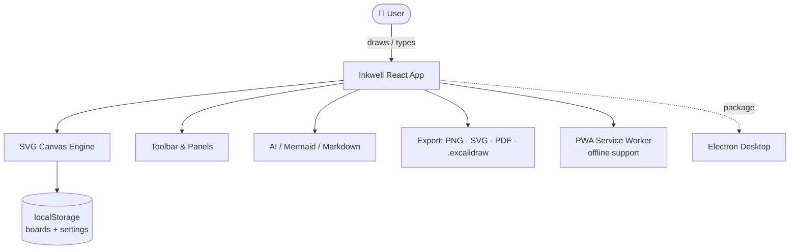
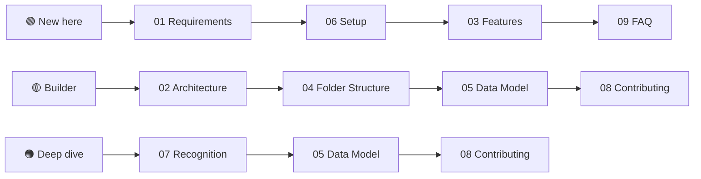

# 🏠 Inkwell Studio — Documentation Index

Welcome! Ye documentation aapko Inkwell (infinite whiteboard + mind-map studio) ko **samajhne, chalane aur contribute** karne me help karegi — bilkul beginner se lekar advanced tak.

> **Project:** Inkwell Studio · **Author:** [SudhirDevOps1](https://github.com/SudhirDevOps1) · **License:** MIT (100% free)

---

## 🗺️ 30-Second Overview

Inkwell **poori tarah client-side** hai — koi backend nahi. Saara data browser ke `localStorage` me save hota hai, aur pehli visit ke baad **offline** bhi chalta hai.

---

## 📚 All Docs

| # | Doc | Kya milega | ⏱️ | 🎚️ |
|---|-----|-----------|----|-----|
| 01 | [Requirements](01-REQUIREMENTS.md) | Prerequisites + free learning links | 10 min | 🟢 |
| 02 | [Architecture](02-ARCHITECTURE.md) | System design + diagrams | 15 min | 🟡 |
| 03 | [Features](03-FEATURES.md) | Har feature detail me | 12 min | 🟢 |
| 04 | [Folder Structure](04-FOLDER-STRUCTURE.md) | File-by-file roles | 10 min | 🟡 |
| 05 | [Data Model](05-DATA-MODEL.md) | Element/board types + storage | 12 min | 🟡 |
| 06 | [Setup & Run](06-SETUP.md) | Local dev, build, deploy, desktop | 10 min | 🟢 |
| 07 | [Recognition Engine](07-RECOGNITION.md) | Shape + handwriting internals | 15 min | 🟠 |
| 08 | [Contributing](08-CONTRIBUTING.md) | How to add features safely | 10 min | 🟡 |
| 09 | [FAQ](09-FAQ.md) | 30+ common questions | 8 min | 🟢 |
| 10 | [Glossary](10-GLOSSARY.md) | A–Z terms in simple Hinglish | 6 min | 🟢 |

---

## 🧭 Learning Paths

- **Complete Beginner:** 01 → 06 → 03 → 09
- **Intermediate Builder:** 02 → 04 → 05 → 08
- **Advanced / Internals:** 07 → 05 → 08

---

## 📊 Project Stats

| Metric | Value |
|---|---|
| Framework | React 19 + TypeScript + Vite 7 |
| Styling | Tailwind CSS 4 |
| Backend | None (local-first) |
| Storage | Browser `localStorage` |
| Offline | PWA service worker |
| Desktop | Electron (optional) |
| Bundle | Single-file `dist/index.html` (~400 KB gzip) |
| License | MIT — free forever |

---

[🏠 Index](00-START-HERE.md) · [➡️ Next: Requirements](01-REQUIREMENTS.md)
