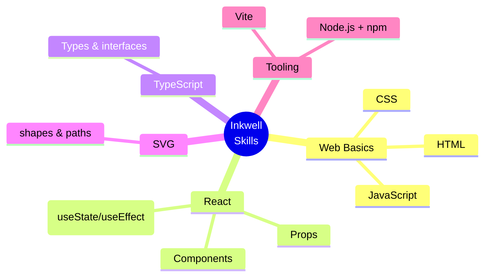

[⬅️ Previous: Index](00-START-HERE.md) · [🏠 Index](00-START-HERE.md) · [➡️ Next: Architecture](02-ARCHITECTURE.md)

# 01 · Requirements & Prerequisites

Inkwell samajhne ke liye kya-kya aana chahiye — aur har cheez ke liye **100% free** learning links.

---

## Kya aana chahiye

| Concept | Inkwell me kahan use hua | Zaroori? |
|---|---|---|
| **HTML/CSS** | Toolbar, modals, panels | ✅ Must |
| **JavaScript (ES6)** | Poora app logic | ✅ Must |
| **React + Hooks** | `MindMapPage`, `WhiteboardCanvas` state | ✅ Must |
| **TypeScript** | `src/types/whiteboard.ts` types | 🟡 Helpful |
| **SVG** | Canvas rendering (shapes, connectors) | 🟡 Helpful |
| **Node.js + npm** | `npm install`, `npm run build` | ✅ Must |
| **localStorage** | Board persistence | 🟢 Basic |

---

## 📚 Free Learning Links (verified)

### JavaScript
- [W3Schools JS](https://www.w3schools.com/js/)
- [MDN JavaScript](https://developer.mozilla.org/en-US/docs/Web/JavaScript)
- [GeeksforGeeks JS](https://www.geeksforgeeks.org/javascript/)

### React
- [Official React Docs](https://react.dev/)
- [W3Schools React](https://www.w3schools.com/react/)
- [Hindi — Apna College](https://www.youtube.com/@ApnaCollegeOfficial)

### TypeScript
- [Official TS Handbook](https://www.typescriptlang.org/docs/)
- [W3Schools TypeScript](https://www.w3schools.com/typescript/)

### SVG
- [MDN SVG Tutorial](https://developer.mozilla.org/en-US/docs/Web/SVG/Tutorial)
- [W3Schools SVG](https://www.w3schools.com/graphics/svg_intro.asp)

### Vite & Node
- [Vite Guide](https://vite.dev/guide/)
- [Node.js Docs](https://nodejs.org/en/docs)

### Hindi YouTube
- [CodeWithHarry](https://www.codewithharry.com/)
- [Telusko](https://www.youtube.com/@Telusko)

---

> 💡 **Real-life analogy:** React components = LEGO blocks. Har block (component) apna kaam karta hai, aur combine hoke poora Inkwell banta hai.

---

[⬅️ Previous: Index](00-START-HERE.md) · [🏠 Index](00-START-HERE.md) · [➡️ Next: Architecture](02-ARCHITECTURE.md)
