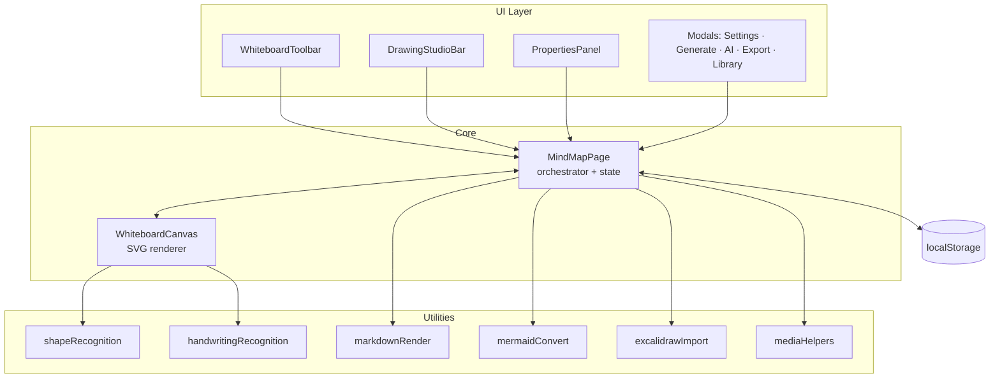
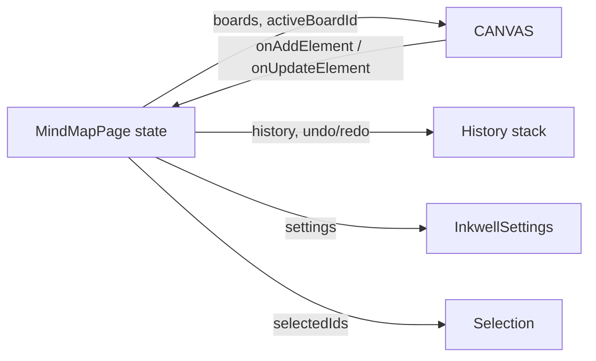
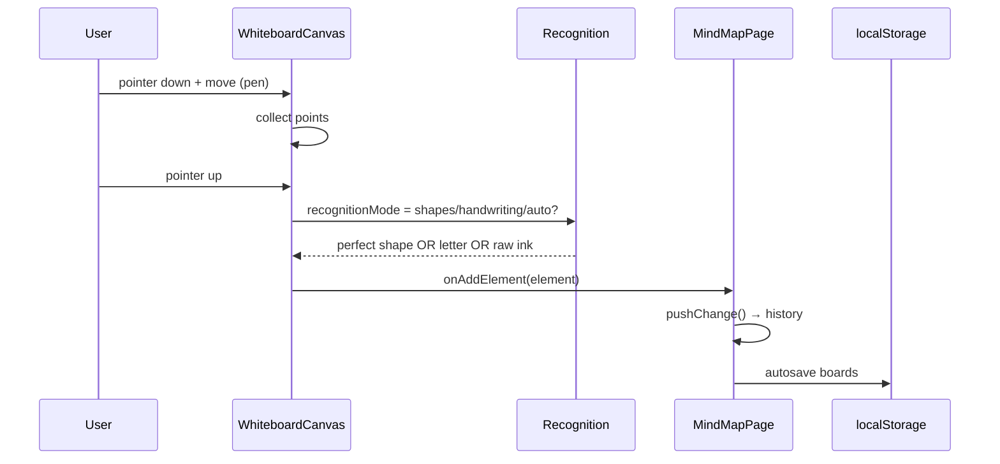
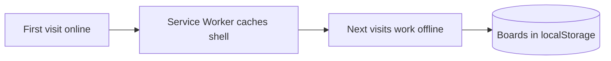

[⬅️ Previous: Requirements](01-REQUIREMENTS.md) · [🏠 Index](00-START-HERE.md) · [➡️ Next: Features](03-FEATURES.md)

# 02 · System Architecture

Inkwell ek **local-first, single-page React app** hai. Koi server nahi — sab kuch browser me chalta hai.

## High-level architecture



---

## State management

Inkwell **local React state** use karta hai (no Redux). `MindMapPage` central orchestrator hai:



- **boards** — array of `WbBoard` (multi-page)
- **history** — 50-step undo/redo per board
- **settings** — persisted in `localStorage` (`inkwell_settings_v1`)
- **selectedIds / selectedConnId** — current selection

---

## Data flow: drawing a stroke



---

## Rendering: pure SVG

Poora canvas ek **SVG element** hai. Har shape ek `<g>` group hai jisme `<rect>`, `<ellipse>`, `<path>` etc. hote hain. Pan/zoom ek transform se hota hai:

```
<g transform="translate(panX, panY) scale(zoom)"> ...elements... </g>
```

**Fayda:** infinite canvas, crisp at any zoom, easy export to SVG/PNG/PDF.

---

## Offline / PWA



---

[⬅️ Previous: Requirements](01-REQUIREMENTS.md) · [🏠 Index](00-START-HERE.md) · [➡️ Next: Features](03-FEATURES.md)
