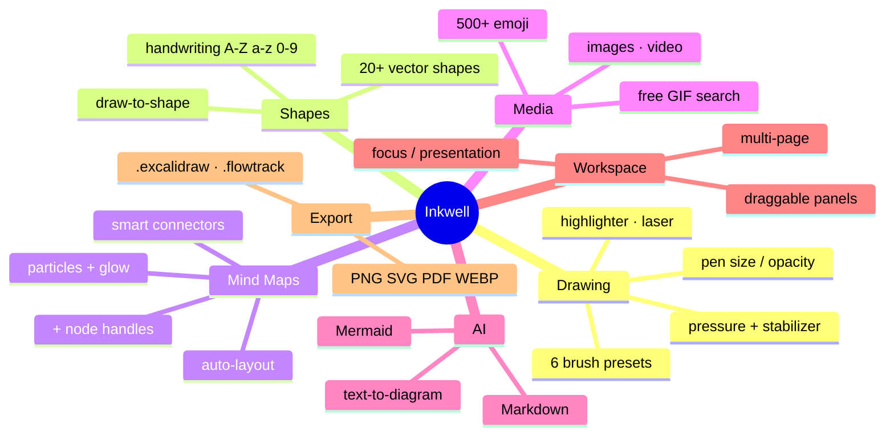

[⬅️ Previous: Architecture](02-ARCHITECTURE.md) · [🏠 Index](00-START-HERE.md) · [➡️ Next: Folder Structure](04-FOLDER-STRUCTURE.md)

# 03 · Features

Inkwell ke saare features — sab **free**, koi paywall nahi.

---

## 🎨 Drawing & Brush Studio
Pen, Pencil, Marker, Brush, Calligraphy, Technical. Pen size (1–40px), opacity, stabilizer, pressure feel. Draggable pen bar.

## 🔷 Shapes & Recognition
20+ vector shapes. **Recognition mode** (Settings): `Raw ink` · `Shapes` · `Letters` · `Auto`. Sirf ek mode chalta hai — no conflict. Detail: [07 Recognition](07-RECOGNITION.md).

## 🧠 Mind Maps
- One-click `+` handles har node pe
- Smart connectors (curved / straight / orthogonal)
- Auto-layout: radial · hierarchical · horizontal
- **Flowing particles + glow** on connectors (Settings → Mind-Map Effects)

## 📝 Rich Notes
Sticky notes & text boxes me markdown: headings, `- bullets`, `1. numbers`, `[ ] checklist`, **bold**, *italic*, `code`, arrows. **Live preview** editor me. `Enter` = new line, `Ctrl+Enter` = save.

## 🖼️ Media
Image upload/drag/paste · YouTube/Vimeo/MP4 embed · local video · free GIF search (Wikimedia + Giphy/Tenor fallback) · 500+ emoji.

## 🤖 AI & Generate
Mermaid → diagram, Markdown → mind map, AI text-to-diagram. Bring-your-own-key: OpenAI, Groq (free), OpenRouter (free), Together, Ollama (local), or custom OpenAI-compatible endpoint. Key localStorage me only.

## 📚 Excalidraw Library
`.excalidraw` + `.excalidrawlib` import. Library shelf — har item thumbnail, click to place. Export back to `.excalidraw`.

## 🎯 Selection
Lasso (free-form), marquee, multi-select resize, group/ungroup, align, distribute, rotate, lock.

## 🖥️ Workspace
Multi-page boards, focus/zen mode, presentation mode, draggable panels, mini-map, undo/redo (50 steps).

## ⚙️ Customization (Settings)
Panel visibility toggles, 10 canvas backgrounds, 4 grid types, reduced motion, high contrast, compact UI, snap-to-grid, recognition mode, particle effects.

## 💾 Export & Offline
PNG · JPG · WEBP · SVG · PDF · `.flowtrack` · `.excalidraw`. Scope (board/selection), scale (1–4×), padding, copy-to-clipboard. PWA offline + Electron desktop.

---

[⬅️ Previous: Architecture](02-ARCHITECTURE.md) · [🏠 Index](00-START-HERE.md) · [➡️ Next: Folder Structure](04-FOLDER-STRUCTURE.md)
