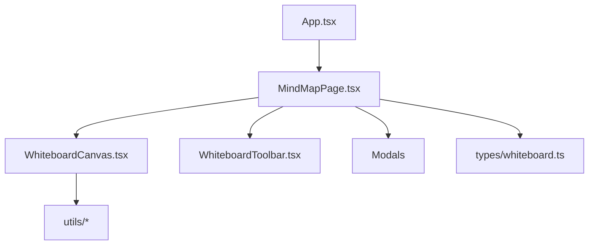

[⬅️ Previous: Features](03-FEATURES.md) · [🏠 Index](00-START-HERE.md) · [➡️ Next: Data Model](05-DATA-MODEL.md)

# 04 · Folder Structure

```
InkWell/
├── docs/                          # Ye documentation
├── electron/
│   ├── main.cjs                   # Electron main process
│   └── README.md                  # Desktop build guide
├── .github/workflows/
│   ├── build.yml                  # Web + Pages + desktop CI
│   └── lint.yml                   # Type-check CI
├── public/
│   ├── inkwell-icon.svg           # App icon
│   ├── manifest.webmanifest       # PWA manifest
│   └── sw.js                      # Service worker (offline)
├── src/
│   ├── App.tsx                    # Root — mounts MindMapPage
│   ├── main.tsx                   # Entry + SW registration
│   ├── index.css                  # Tailwind + custom styles
│   ├── types/
│   │   └── whiteboard.ts          # All TypeScript types
│   ├── hooks/
│   │   └── useDraggable.ts        # Reusable drag hook
│   ├── utils/
│   │   ├── whiteboardUtils.ts     # Geometry, layouts, templates
│   │   ├── shapeRecognition.ts    # Draw-to-shape engine
│   │   ├── handwritingRecognition.ts # $1 recognizer (A-Z, a-z, 0-9)
│   │   ├── markdownRender.ts      # Markdown → HTML (live preview)
│   │   ├── richTextFormatter.ts   # Note auto-formatting
│   │   ├── mermaidConvert.ts      # Mermaid + Markdown → diagram
│   │   ├── excalidrawImport.ts    # .excalidraw / .excalidrawlib
│   │   └── mediaHelpers.ts        # GIF search, media URLs, emoji
│   └── components/whiteboard/
│       ├── MindMapPage.tsx        # 🎯 Orchestrator (state, history, keys)
│       ├── WhiteboardCanvas.tsx   # 🎨 SVG renderer + pointer/touch
│       ├── WhiteboardToolbar.tsx  # Header + left tool rail
│       ├── DrawingStudioBar.tsx   # Brush controls
│       ├── WhiteboardPropertiesPanel.tsx
│       ├── ConnectorPropertiesPanel.tsx
│       ├── TextEditorModal.tsx    # Rich text + live markdown preview
│       ├── SettingsModal.tsx      # All settings
│       ├── GenerateModal.tsx      # Mermaid / Markdown / AI
│       ├── AISetupModal.tsx       # Provider + API key
│       ├── LibraryPanel.tsx       # Excalidraw library shelf
│       ├── GifEmojiPicker.tsx     # GIF + emoji browser
│       ├── ExportShareModal.tsx   # Export / import
│       ├── TemplateGeneratorModal.tsx
│       ├── ShortcutsHelpModal.tsx
│       ├── WhiteboardMiniMap.tsx
│       └── ToolbarPopover.tsx     # Portal popovers (no clipping)
├── index.html
├── README.md
└── LICENSE
```

---

## Key files ke roles



| File | Role | Key exports |
|---|---|---|
| `MindMapPage.tsx` | Central state, undo/redo, keyboard, autosave | `MindMapPage` |
| `WhiteboardCanvas.tsx` | SVG render, pointer/touch, recognition trigger | `WhiteboardCanvas` |
| `shapeRecognition.ts` | Stroke → circle/rect/triangle/diamond/line | `recognizeShape`, `toElement` |
| `handwritingRecognition.ts` | Stroke → A-Z/a-z/0-9 | `recognizeStrokes` |
| `whiteboardUtils.ts` | Geometry, connectors, templates | `uid`, `buildConnPath`, … |
| `types/whiteboard.ts` | `WbElement`, `WbConn`, `WbBoard` | types |

---

[⬅️ Previous: Features](03-FEATURES.md) · [🏠 Index](00-START-HERE.md) · [➡️ Next: Data Model](05-DATA-MODEL.md)
