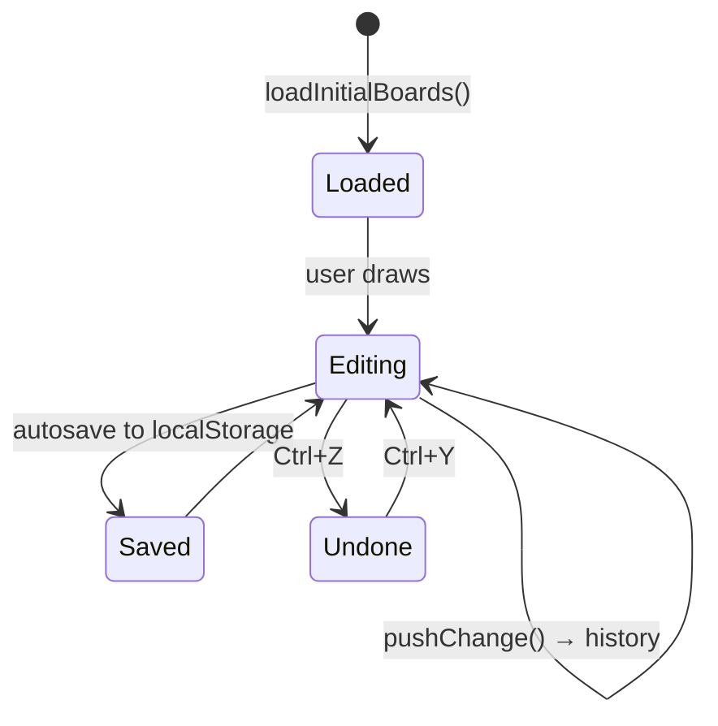

[⬅️ Previous: Folder Structure](04-FOLDER-STRUCTURE.md) · [🏠 Index](00-START-HERE.md) · [➡️ Next: Setup](06-SETUP.md)

# 05 · Data Model

Inkwell me koi SQL database nahi — sab kuch **TypeScript objects** hain jo `localStorage` me JSON ke roop me save hote hain.

## Core entities

```mermaid
erDiagram
    WbBoard ||--o{ WbElement : contains
    WbBoard ||--o{ WbConn : contains
    WbConn }o--|| WbElement : from
    WbConn }o--|| WbElement : to

    WbBoard {
        string id
        string title
        number zoom
        Point pan
        GridType gridType
    }
    WbElement {
        string id
        ShapeType type
        number x
        number y
        number w
        number h
        string label
        string color
        string fill
        Point[] points
    }
    WbConn {
        string id
        string fromId
        string toId
        ConnectorType type
        string color
    }
```

---

## `WbElement` — sabse important

Har cheez canvas pe ek `WbElement` hai (shape, text, sticky, image, video, stamp, freehand).

| Field | Kya hai |
|---|---|
| `id` | Unique ID (`uid()`) |
| `type` | `rect`, `circle`, `diamond`, `mind-map`, `sticky`, `text`, `draw`, `line`, `arrow`, `image`, `video`, `stamp`… |
| `x, y, w, h` | Position + size |
| `label` | Text content |
| `color` / `fill` | Stroke / fill colors |
| `strokeWidth` / `strokeStyle` | Line width, solid/dashed/dotted |
| `points` | Freehand/line/arrow ke relative points |
| `rotation` | Degrees |
| `groupId` | Grouped elements ka shared id |
| `fontSize` / `fontFamily` / `textColor` | Typography |
| `imageSrc` | Image/video/GIF URL |

---

## Storage keys

| Key | Data |
|---|---|
| `flowtrack_whiteboards_v3` | All boards (pages) |
| `inkwell_settings_v1` | User settings |
| `inkwell_libraries_v1` | Excalidraw library shelf |
| `inkwell_ai_config_v1` | AI provider config (key stays local) |

---

## Board lifecycle



> 💡 **Viva me kaise bolenge:** "Inkwell local-first hai — har board ek JSON object hai jo browser ke localStorage me persist hota hai, isliye offline bhi chalta hai aur privacy 100% rehti hai."

---

[⬅️ Previous: Folder Structure](04-FOLDER-STRUCTURE.md) · [🏠 Index](00-START-HERE.md) · [➡️ Next: Setup](06-SETUP.md)
