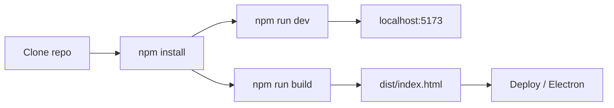

[⬅️ Previous: Data Model](05-DATA-MODEL.md) · [🏠 Index](00-START-HERE.md) · [➡️ Next: Recognition](07-RECOGNITION.md)

# 06 · Setup & Run



---

## Prerequisites
- [Node.js](https://nodejs.org/en/download) 18+ (20 recommended)
- npm (Node ke saath aata hai)

Check:
```bash
node -v   # v20.x
npm -v    # 10.x
```

---

## Local development

```bash
git clone https://github.com/SudhirDevOps1/InkWell.git
cd InkWell
npm install
npm run dev
```

Browser: `http://localhost:5173`

---

## Production build

```bash
npm run build      # → dist/index.html (single file)
npm run preview    # local preview of the build
```

`dist/index.html` **self-contained** hai — direct disk se bhi khul jaata hai.

---

## Deploy (free options)

| Platform | Steps |
|---|---|
| **GitHub Pages** | Push to `main` → workflow auto-deploys (`.github/workflows/build.yml`) |
| **Vercel** | Import repo → framework Vite → deploy |
| **Netlify** | Build `npm run build`, publish `dist` |
| **Any static host** | Upload `dist/` |

---

## Desktop app (Electron)

Poori guide: [electron/README.md](../electron/README.md)

```bash
npm install -D electron electron-builder concurrently wait-on
npm run electron:dev      # dev window (scripts package.json me add karein)
npm run build && npx electron-builder   # installers → release/
```

> `package.json` scripts manually add karne padte hain — electron/README.md me exact JSON diya hai.

---

## Troubleshooting

| Problem | Fix |
|---|---|
| `npm install` fails | Node 20 use karein, `npm cache clean --force` |
| Port 5173 busy | `npm run dev -- --port 3000` |
| Blank page after build | `dist/index.html` ko HTTP server se kholein (file:// bhi chalega) |
| Service worker stale | DevTools → Application → Service Workers → Unregister |

---

[⬅️ Previous: Data Model](05-DATA-MODEL.md) · [🏠 Index](00-START-HERE.md) · [➡️ Next: Recognition](07-RECOGNITION.md)
