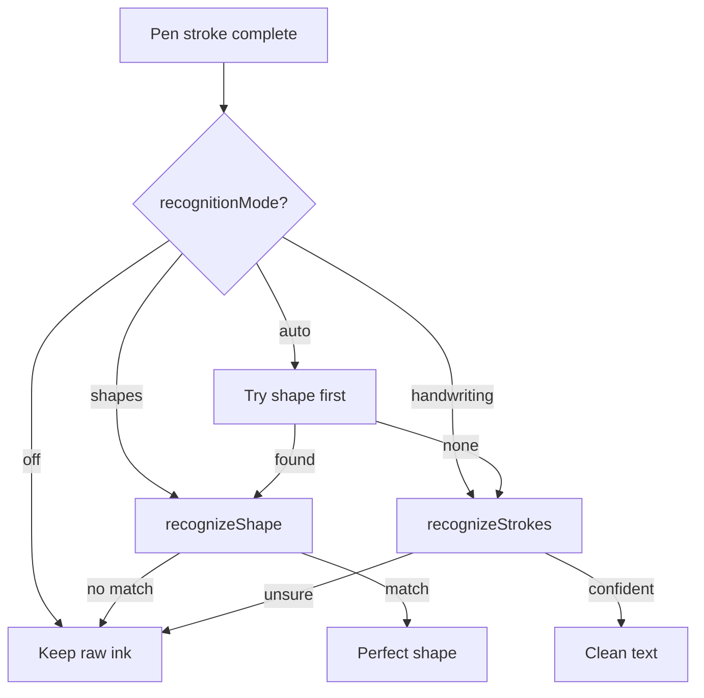
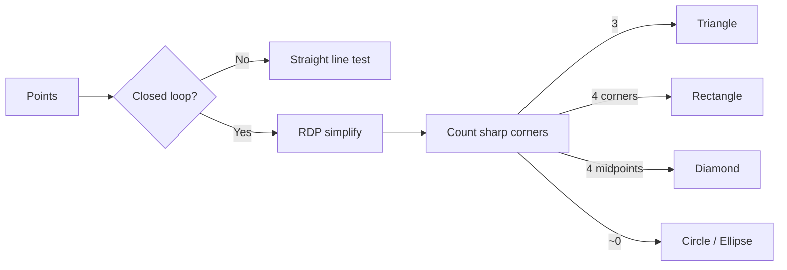
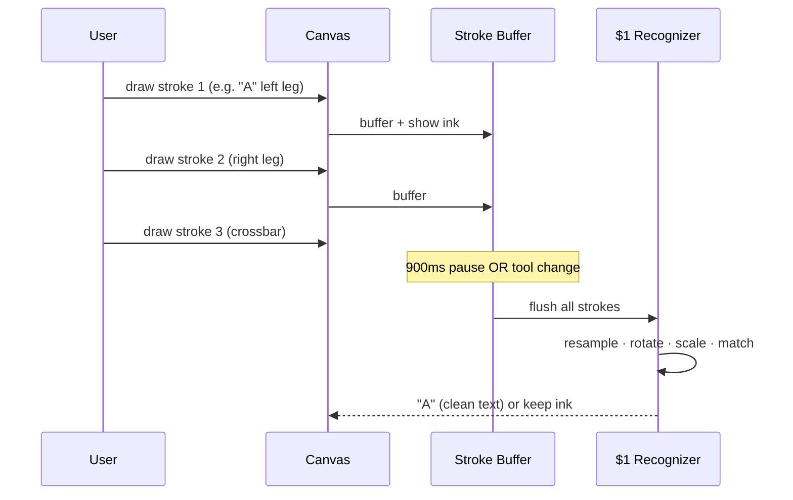

[⬅️ Previous: Setup](06-SETUP.md) · [🏠 Index](00-START-HERE.md) · [➡️ Next: Contributing](08-CONTRIBUTING.md)

# 07 · Recognition Engine

Inkwell do tarah ki recognition karta hai: **shapes** aur **handwriting**. Dono ek **single mode** se control hote hain taaki conflict na ho.

## Recognition mode (Settings)

> **Ye fix kyun important tha:** pehle shapes aur handwriting dono ON hote the, toh square banane pe circle ya galat letter ban jaata tha. Ab ek time pe sirf ek mode chalta hai.

---

## Shape recognition (`shapeRecognition.ts`)

**Technique:**
- **Ramer–Douglas–Peucker** simplification se real corners nikalte hain
- **Turn angle** > 45° = sharp corner
- Corner count + placement → triangle / rectangle / diamond
- Low radial spread + no corners → circle

---

## Handwriting recognition (`handwritingRecognition.ts`)

**$1 Unistroke Recognizer** (Wobbrock 2007) + multi-stroke buffer:

**Coverage:** A–Z, a–z, 0–9, `+ - = ? ! * /` — har glyph ke multiple variants for real handwriting.

**Accuracy tricks:**
- Resample to 64 points
- Rotation-invariant (thoda tirchha bhi chalega)
- Scale-independent
- Aspect-ratio bonus (I vs O, l vs D, - vs =)
- Stroke-count agreement bonus
- Confidence threshold 0.60 (random sketch reject)

---

> 💡 **Real-life analogy:** $1 recognizer ek "shape stamp collection" jaisa hai — aapki drawing ko har stamp se overlap karke sabse best match dhoondta hai.

Tune karne ke liye: `handwritingRecognition.ts` me `LETTER_TEMPLATES` me aur variants add karein.

---

[⬅️ Previous: Setup](06-SETUP.md) · [🏠 Index](00-START-HERE.md) · [➡️ Next: Contributing](08-CONTRIBUTING.md)
