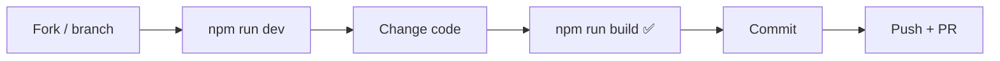
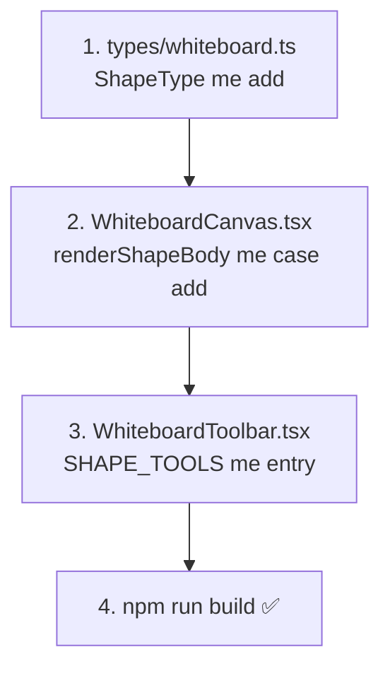

[⬅️ Previous: Recognition](07-RECOGNITION.md) · [🏠 Index](00-START-HERE.md) · [➡️ Next: FAQ](09-FAQ.md)

# 08 · Contributing

Inkwell ko behtar banane me help karein! Ye guide batati hai **safely** feature kaise add karein.

## Workflow



```bash
git checkout -b feature/my-feature
npm run dev
# ...changes...
npm run build     # MUST pass — TypeScript strict
git commit -m "feat: my feature"
git push origin feature/my-feature
```

---

## Golden rules

1. **Kuch mat hatao** — sirf add/improve karo. Backward compatibility zaroori.
2. **Build pass hona chahiye** — `npm run build` zero errors.
3. **Free forever** — koi paywall ya paid-only feature nahi.
4. **Local-first** — user data kabhi bahar mat bhejo (AI keys bhi localStorage me).
5. **Types first** — naya field pehle `types/whiteboard.ts` me add karo.

---

## Naya shape type kaise add karein



**Example steps:**
1. `ShapeType` union me `"my-shape"` add karo
2. `renderShapeBody()` me `if (el.type === "my-shape") return <path ... />`
3. Toolbar ke `SHAPE_TOOLS` array me add karo
4. Build karo

---

## Naya setting kaise add karein

1. `SettingsModal.tsx` — `InkwellSettings` interface + `DEFAULT_SETTINGS` me field
2. `SettingsModal.tsx` — ek `<Toggle>` ya control render karo
3. `MindMapPage.tsx` — setting ko relevant component me pass karo
4. localStorage auto-persist ho jaayega

---

## Naya AI provider kaise add karein

`AISetupModal.tsx` ke `PROVIDERS` array me entry add karo:
```ts
{ id: "myprovider", name: "My Provider", endpoint: "https://...", models: ["model-1"], keyHint: "key-" }
```
Provider **OpenAI-compatible** hona chahiye (`/chat/completions`, `model` + `messages`).

---

## Code style
- TypeScript strict, no `any` jahan possible ho
- Tailwind classes for styling
- Components chhote aur focused rakho
- Comments English me, user-facing text Hinglish OK

---

## Commit convention
- `feat:` naya feature
- `fix:` bug fix
- `docs:` documentation
- `refactor:` code cleanup

---

[⬅️ Previous: Recognition](07-RECOGNITION.md) · [🏠 Index](00-START-HERE.md) · [➡️ Next: FAQ](09-FAQ.md)
