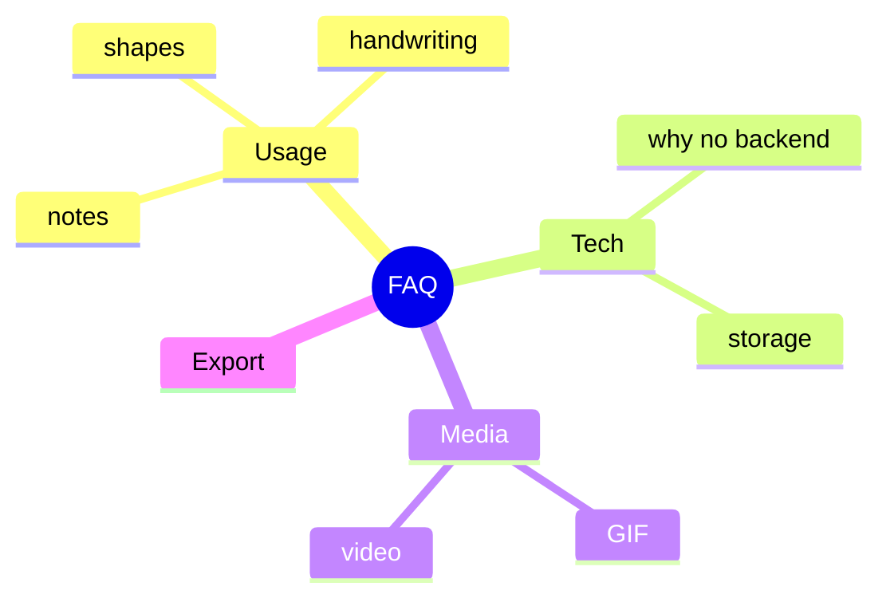

[⬅️ Previous: Contributing](08-CONTRIBUTING.md) · [🏠 Index](00-START-HERE.md) · [➡️ Next: Glossary](10-GLOSSARY.md)

# 09 · FAQ

---

## Usage

**Q: Square banata hoon toh circle kyun banta tha?**
Pehle shape + handwriting dono ON the. Ab **Settings → Pen recognition mode** me ek hi mode select karein (Shapes / Letters / Auto / Raw). Fix ho gaya.

**Q: Handwriting kaam nahi kar raha?**
Settings → recognition mode = **Letters** ya **Auto**. Phir pen se ek letter likho, thoda ruko (900ms) — clean text ban jaayega. Multi-stroke letters (A, K, R) ke liye saare strokes jaldi-jaldi banao.

**Q: Note me bullet/checklist kaise?**
Sticky/text pe double-click → toolbar se bullet/number/checklist button, ya type `- item`, `1. item`, `[ ] task`. **Enter** = agli line (list continue), **Ctrl+Enter** = save.

**Q: Enter dabane se save ho jaata tha?**
Ab `Enter` = new line, `Ctrl+Enter` = save, `Esc` = cancel.

**Q: Text aadha dikhta tha resize pe?**
Fix — notes/text auto-grow karte hain aur text wrap hota hai.

**Q: Lasso se select kaise?**
Left rail me lasso tool (ya `Shift+L`), phir items ke around free-form circle banao.

**Q: Excalidraw library import karne pe sab ek saath aa jaate the?**
Ab library **shelf** me thumbnails aate hain — book icon kholo, ek-ek item click karke place karo. Imported shapes ab sahi resize bhi hote hain.

---

## Tech choices

**Q: Backend kyun nahi?**
Local-first design — privacy, speed, offline, zero hosting cost. Sab localStorage me.

**Q: Data kahan save hota hai?**
Browser `localStorage`. Export `.flowtrack` se backup lo.

**Q: Offline chalega?**
Haan — PWA service worker pehli visit ke baad app cache karta hai.

**Q: AI key safe hai?**
Key sirf aapke browser (localStorage) me rehti hai, sirf aapke chosen provider ko jaati hai.

---

## Media

**Q: GIF search free hai?**
Haan — Wikimedia Commons (keyless) primary, Giphy/Tenor fallback.

**Q: YouTube video kaise?**
Film tool → URL paste (watch/embed/youtu.be sab chalega) ya local video file choose karo.

---

## Export

**Q: Kaunse formats?**
PNG, JPG, WEBP, SVG, PDF, `.flowtrack` (project), `.excalidraw`.

**Q: Sirf selection export?**
Export modal → Scope = Selection. Scale 1–4× bhi choose kar sakte ho.

**Q: Clipboard pe copy?**
Export modal → "Copy image" button.

---

## Desktop / Mobile

**Q: Desktop app?**
Electron — dekho [electron/README.md](../electron/README.md).

**Q: Tablet/mobile?**
PWA install karo (browser → Install). Capacitor se native Android bhi ban sakta hai.

---

[⬅️ Previous: Contributing](08-CONTRIBUTING.md) · [🏠 Index](00-START-HERE.md) · [➡️ Next: Glossary](10-GLOSSARY.md)
