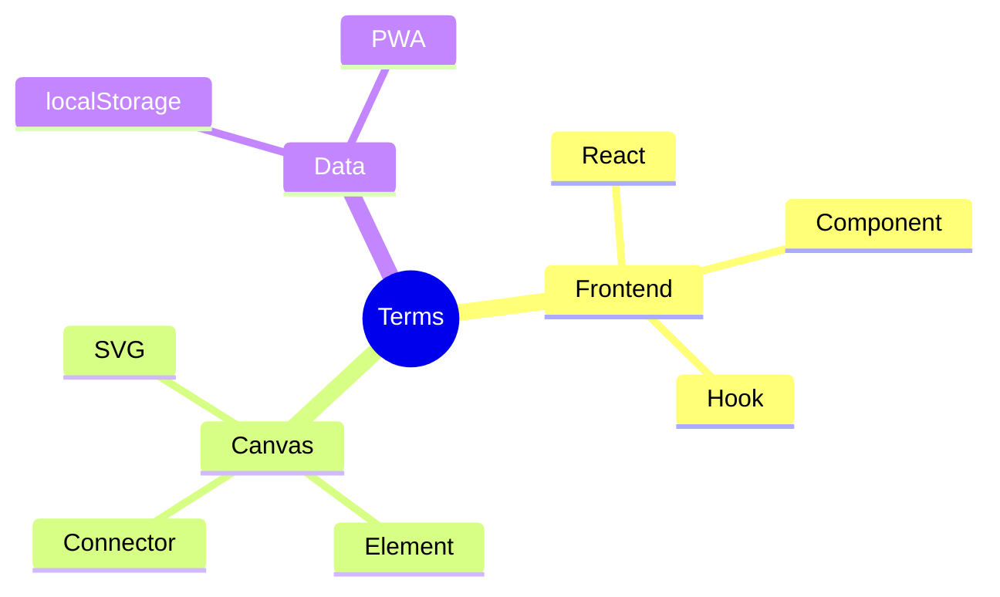

[⬅️ Previous: FAQ](09-FAQ.md) · [🏠 Index](00-START-HERE.md)

# 10 · Glossary

Har technical term ka simple Hinglish matlab + Inkwell example.

---

| Term | Simple matlab | Inkwell example |
|---|---|---|
| **React** | UI banane ki JS library | Poora Inkwell React me hai |
| **Component** | Reusable UI block | `WhiteboardToolbar`, `SettingsModal` |
| **Hook** | React ka function (state/effect) | `useState`, `useDraggable` |
| **Props** | Component ko diye gaye inputs | `<WhiteboardCanvas els={...} />` |
| **State** | Component ka current data | `boards`, `selectedIds` |
| **SVG** | Vector graphics format | Canvas ke saare shapes |
| **Element** (`WbElement`) | Canvas pe ek object | Shape, note, image |
| **Connector** (`WbConn`) | Do elements jodne wali line | Mind-map arrows |
| **Board** (`WbBoard`) | Ek page / whiteboard | Multi-page tabs |
| **localStorage** | Browser ka storage | Boards yahan save hote |
| **PWA** | Installable web app | Offline Inkwell |
| **Service Worker** | Background offline script | `public/sw.js` |
| **Vite** | Fast build tool | `npm run dev` / `build` |
| **Electron** | Web app → desktop app | `electron/main.cjs` |
| **Capacitor** | Web app → mobile app | Android/iOS build |
| **Mermaid** | Text → diagram syntax | Generate modal |
| **$1 Recognizer** | Handwriting algorithm | `handwritingRecognition.ts` |
| **RDP** | Line simplify algorithm | Shape recognition |
| **Lasso** | Free-form selection | `Shift+L` |
| **Marquee** | Box selection | Drag on empty canvas |
| **uid** | Unique ID generator | Har element ka id |

---

## Acronyms

| Short | Full |
|---|---|
| PWA | Progressive Web App |
| SVG | Scalable Vector Graphics |
| RDP | Ramer–Douglas–Peucker |
| CI | Continuous Integration |
| MIT | Massachusetts Institute of Technology (license) |

---

## 1-minute project pitch

> "Inkwell ek **free, offline-first infinite whiteboard aur mind-map studio** hai — React + SVG me bana. Isme drawing, shape/handwriting recognition, mind maps with particles, Mermaid/Markdown/AI diagram generation, media embed, aur PNG/PDF/SVG export hai. Koi backend nahi, koi paywall nahi — sab kuch browser me chalta hai aur PWA/Electron se install ho sakta hai."

---

[⬅️ Previous: FAQ](09-FAQ.md) · [🏠 Index](00-START-HERE.md)
